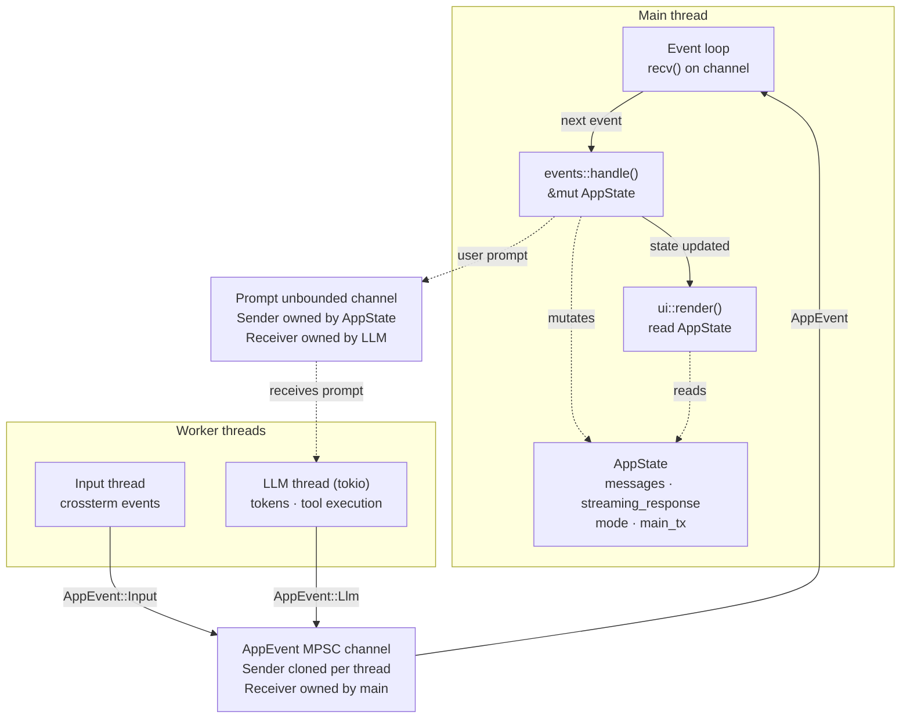

# Chris Code

## Architecture

```mermaid
flowchart TB
    subgraph main["Main thread"]
        loop["Event loop\nrecv() on channel"]
        handler["events::handle()\n&mut AppState"]
        render["ui::render()\nread AppState"]
        state["AppState\nmessages · streaming_response\nmode · main_tx"]

        loop -->|next event| handler
        handler -->|state updated| render
        handler -.->|mutates| state
        render -.->|reads| state
    end

    subgraph workers["Worker threads"]
        input["Input thread\ncrossterm events"]
        llm["LLM thread (tokio)\ntokens · tool execution"]
    end

    channel["AppEvent MPSC channel\nSender cloned per thread\nReceiver owned by main"]
    prompt_channel["Prompt unbounded channel\nSender owned by AppState\nReceiver owned by LLM"]

    input -->|AppEvent::Input| channel
    llm -->|AppEvent::Llm| channel
    channel -->|AppEvent| loop
    handler -.->|user prompt| prompt_channel
    prompt_channel -.->|receives prompt| llm
```
